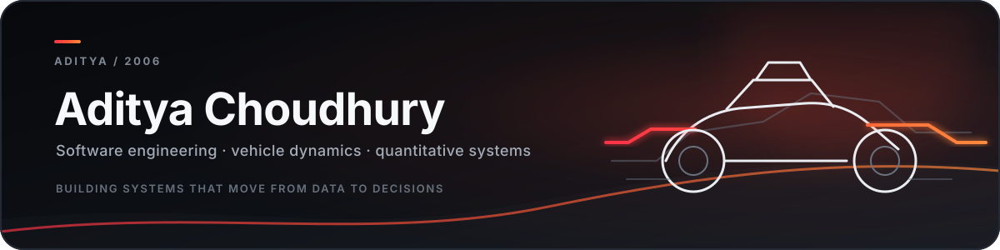
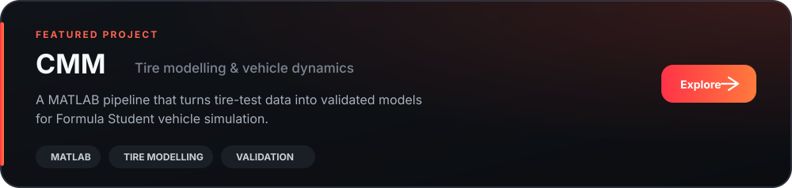

<!--
  MINIMAL FORMULA-INSPIRED GITHUB PROFILE

  SETUP
  1. Create a PUBLIC repository named exactly: aditya-ac2006
  2. Save this file there as README.md
  3. Upload the included assets folder beside README.md
  4. Replace YOUR_LINKEDIN_URL and YOUR_EMAIL_ADDRESS
-->

  

&nbsp;
&nbsp;

 

## About

I'm a Computer Science Engineering student at **MIT Bengaluru**, building at the intersection of software, data and real-world engineering.

My current work is centred on **Formula Student vehicle dynamics**—turning experimental tire data into validated models and, eventually, a complete lap-time simulation environment. I'm also exploring finance through code, market data and quantitative projects.

## Selected work

## Currently

- Developing and validating a MATLAB tire-model pipeline
- Working toward vehicle-model and Simulink integration
- Strengthening software-engineering and data-structures fundamentals
- Planning a finance and market-data project
- Building an interactive portfolio alongside these projects

## Toolbox

  

`MATLAB` &nbsp; `NumPy` &nbsp; `pandas` &nbsp; `Matplotlib` &nbsp; `Jupyter` &nbsp; `Simulink`

## Let's build something interesting

I'm open to conversations around software engineering, fintech, Formula Student, tire modelling and vehicle dynamics.

&nbsp;

  

Building carefully. Learning continuously. Shipping the work.

